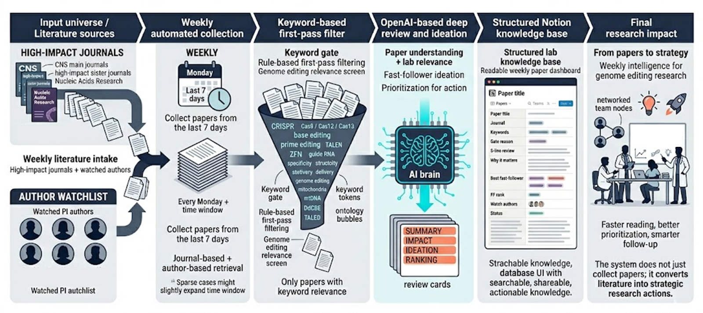

# High-Impact Genome Editing Literature Tracker

<p align="center">
  
</p>

A production-oriented literature triage pipeline for **genome editing labs**.

This project scans a curated **high-impact journal pool** plus a **watchlist of key corresponding / senior authors**, filters papers using a boolean gate, ranks the matched papers, and writes a **reader-friendly review card** into Notion.

For every selected paper, the tracker produces:
- a **5-line review** in Korean by default
- **Why It Matters** for the lab
- one **best fast-follower**
- a concrete **first experiment**
- a **fast-follower score / rank**
- a one-line **share blurb**

---

## What this tracker is optimized for

This is **not** a generic paper summarizer.

It is designed for labs that care about:
- genome editing broadly
- CRISPR / Cas systems
- base editing / prime editing
- TALEN / zinc-finger / programmable nuclease platforms
- editor engineering, off-target behavior, specificity, and structural biology
- delivery and compact editor strategy
- mitochondrial editing and mitochondrial biology as an important subdomain

The ranking is now **genome-editing-first**.
mtDNA and mitochondria remain important, but they are treated as part of the broader landscape rather than the only priority axis.

---

## Core design

### 1) Two collection streams
The tracker collects from both:

**A. Journal watch**
- Nature
- Nature Biotechnology
- Nature Methods
- Nature Genetics
- Nature Medicine
- Nature Neuroscience
- Nature Structural & Molecular Biology
- Nature Chemical Biology
- Nature Biomedical Engineering
- Nature Cell Biology
- Nature Metabolism
- Nature Communications
- Science
- Science Translational Medicine
- Cell
- Molecular Cell
- Neuron
- Cell Metabolism
- Cell Stem Cell
- Nucleic Acids Research

**B. PI / watch-author stream**
Recent papers are also pulled for the following author watchlist:
- David R. Liu
- Jennifer A. Doudna
- Feng Zhang
- Jay Shendure
- Omar O. Abudayyeh
- Jonathan S. Gootenberg
- Patrick D. Hsu
- Samuel H. Sternberg
- Caixia Gao
- Wensheng Wei
- Sangsu Bae
- Hyongbum Henry Kim

This makes the tracker robust even when a directly relevant paper appears outside the journal preset.

---

## How the pipeline works

### 1. Collect
- High-impact journal query via Crossref
- Watch-author query via Crossref `query.author`

### 2. Enrich
PubMed enrichment is optional but recommended.
When available, the tracker adds:
- PMID
- abstract
- MeSH / keyword metadata
- author list
- corresponding-author candidates inferred from affiliation emails

### 3. Boolean gate
A paper passes if:
- relevant terms appear in the **title** or **keyword list**, or
- strong editor terms appear in the **abstract**, or
- the paper matches the **watch-author logic**

The gate is intentionally broad enough to catch:
- genome editing core papers
- editor engineering / specificity / off-target papers
- delivery and compact-editor papers
- mitochondrial editing papers
- selected mitochondrial biology papers

### 4. Rank
Only gated papers are ranked.

The ranking is now organized around four buckets:
- **Editing core**
- **Editor engineering**
- **Delivery / translation**
- **Mitochondrial bonus**

This avoids overfitting to mtDNA while still rewarding papers that matter for mitochondrial editing.

### 5. Generate a reading card
The LLM writes:
- 5-line review
- why it matters to the lab
- technical takeaway
- best fast-follower
- first experiment
- FF score / rank
- one-line share blurb

### 6. Save to Notion
Each reviewed paper is written as a Notion page under the configured database.

---

## Recommended operating mode

### Weekly mode (recommended)
For this source universe, **weekly review is more stable than daily review**.

Recommended settings:
- `days_back = 7`
- `min_gated = 5`
- `max_days_back = 35`
- `expand_step_days = 7`
- `llm_limit = 10`

This gives a dense enough set for a team digest or lab meeting discussion.

### On-demand mode
You can still run the pipeline manually after a major paper drop, conference, or relevant preprint-to-paper transition.

---

## Reader-facing language

Reader-facing long-form output is **Korean by default** (`READER_LANGUAGE=ko`).

This applies to:
- `5-line Review`
- `Why It Matters`
- `Best Fast-Follower`
- `Share Blurb`
- page body section headings and explanations

Structured metadata stays mostly stable / English-friendly so Notion filtering remains reliable.

---

## Quick start

### 1) Create the environment

```bash
sudo apt update
sudo apt install -y python3 python3-venv python3-pip

cd cns_mt_tracker_high_impact
python3 -m venv .venv
source .venv/bin/activate
pip install --upgrade pip
pip install -r requirements.txt
cp .env.example .env
```

### 2) Fill `.env`

Minimum required:

```bash
OPENAI_API_KEY=...
NOTION_API_KEY=...
NOTION_DATABASE_ID=...
```

Recommended defaults:

```bash
OPENAI_MODEL=gpt-5.4-mini
READER_LANGUAGE=ko
TIMEZONE=Asia/Seoul

DAYS_BACK=7
LLM_REVIEW_LIMIT=10
MIN_GATED_PAPERS=5
MAX_DAYS_BACK=35
EXPAND_STEP_DAYS=7

CROSSREF_ROWS_PER_JOURNAL=50
CROSSREF_ROWS_PER_AUTHOR=10
JOURNAL_PRESET=cns_high_impact
ENABLE_PUBMED_ENRICHMENT=true

CROSSREF_MAILTO=your_email@example.com
NCBI_EMAIL=your_email@example.com
NCBI_API_KEY=
```

### 3) Prepare Notion

Share the **original Notion database** with your integration, then run:

```bash
python scripts/bootstrap_notion.py --apply
```

### 4) Weekly dry-run

```bash
./scripts/run_weekly.sh --dry-run
```

### 5) Weekly real run (writes to Notion)

```bash
./scripts/run_weekly.sh
```

---

## CLI examples

### Weekly dry-run with explicit args

```bash
python scripts/run_daily.py \
  --journal-preset cns_high_impact \
  --days-back 7 \
  --min-gated 5 \
  --max-days-back 35 \
  --expand-step-days 7 \
  --llm-limit 10 \
  --dry-run
```

### Skip PubMed enrichment

```bash
python scripts/run_daily.py --skip-pubmed --dry-run
```

### Run only flagship journals

```bash
python scripts/run_daily.py --journal-preset cns_main --dry-run
```

---

## Notion field guide

### Reader-facing fields
- **Paper**: paper title
- **Journal**: journal name
- **Published**: publication date
- **Paper Keywords**: paper-reported or extracted keywords
- **Gate Reason**: why the paper passed the initial filter
- **5-line Review**: fast skim summary
- **Why It Matters**: lab relevance
- **Best Fast-Follower**: best follow-up idea
- **FF Rank**: actionability bucket
- **DOI/URL**: canonical link
- **Status**: reading / discussion state

### Operational fields
- **Lane**: Genome editing core / Editor engineering / Delivery & translation / Mitochondrial editing / Mitochondrial biology / General biology
- **Prescore**: internal ranking score among gated papers
- **LLM Priority**: LLM-assigned importance
- **Matched Keywords**: additional matched terms used in ranking
- **Watch Authors**: matched watchlist PI names
- **Watch Basis**: author-list / last-author / PubMed email heuristic basis
- **Corresponding Authors**: corresponding-author candidates inferred from PubMed affiliation emails
- **Source**: metadata source
- **PMID**: PubMed identifier
- **Discuss This Week**: auto-checked for stronger candidates

---

## Customization

### Add more gate keywords
Edit:
- `app/keywords.py`

Useful sections:
- `GENOME_EDITING_GATE_TERMS`
- `ENGINEERING_GATE_TERMS`
- `DELIVERY_GATE_TERMS`
- `MITO_EDITING_GATE_TERMS`
- `MITO_BIO_GATE_TERMS`

### Add more watched authors
Edit:
- `WATCHED_AUTHOR_ALIASES` in `app/keywords.py`

### Change ranking behavior
Edit:
- `RANK_BUCKETS` in `app/keywords.py`
- synergy logic in `app/prescore.py`

### Change output language
Edit `.env`:

```bash
READER_LANGUAGE=ko
```

or

```bash
READER_LANGUAGE=en
```

---

## GitHub checklist

Before pushing:
- ensure `.env` is not tracked
- ensure `outputs/` is not tracked
- ensure `.venv/` is not tracked

Initial push:

```bash
git init
git add .
git commit -m "Initial commit"
git branch -M main
git remote add origin https://github.com/YOUR_USERNAME/YOUR_REPO.git
git push --set-upstream origin main
```

---

## Notes on watch-author logic

Crossref does not expose a clean corresponding-author filter for this workflow.
So the tracker uses a **best-effort heuristic**:
- direct author-query collection
- direct author-list matching
- last-author fallback
- PubMed affiliation-email detection for stronger corresponding-author evidence

This is intended for triage and organization, not for formal bibliometric attribution.
